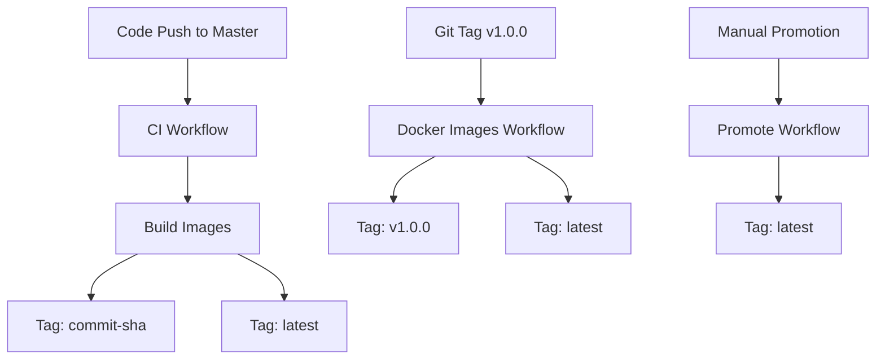

# Docker Tagging Strategy

This document outlines the Docker image tagging strategy for MicroRealEstate WhatsApp integration.

## 🏷️ Tagging Strategy Overview

### Registry
All images are stored in **GitHub Container Registry (GHCR)**:
- Registry: `ghcr.io`
- Repository: `ghcr.io/perezjoseph/microrealestate-whatsapp`

### Image Naming Convention
```
ghcr.io/perezjoseph/microrealestate-whatsapp/<service>:<tag>
```

Where `<service>` is one of:
- **Backend Services**: `api`, `authenticator`, `cache`, `emailer`, `gateway`, `monitoring`, `pdfgenerator`, `resetservice`, `tenantapi`, `whatsapp`
- **Frontend Applications**: `landlord-frontend`, `tenant-frontend`

## 📋 Tag Types

### 1. Commit-based Tags
- **Format**: `<commit-sha>` (e.g., `fd853c82c292022937d6cae8dcda052d0eb930e7`)
- **When**: Every push to master branch
- **Purpose**: Immutable reference to specific code version
- **Example**: `ghcr.io/perezjoseph/microrealestate-whatsapp/api:fd853c82c292022937d6cae8dcda052d0eb930e7`

### 2. Branch-based Tags
- **Format**: `master-latest`
- **When**: Push to master branch
- **Purpose**: Latest build from master branch
- **Example**: `ghcr.io/perezjoseph/microrealestate-whatsapp/api:master-latest`

### 3. Latest Tag
- **Format**: `latest`
- **When**: 
  - Push to master branch (CI workflow)
  - Release tags (v*.*.*)
  - Manual promotion via workflow_dispatch
- **Purpose**: Production-ready version
- **Example**: `ghcr.io/perezjoseph/microrealestate-whatsapp/api:latest`

### 4. Version Tags
- **Format**: `v1.0.0`, `v1.0.1`, etc.
- **When**: Git tags matching `v*.*.*` pattern
- **Purpose**: Semantic versioning for releases
- **Example**: `ghcr.io/perezjoseph/microrealestate-whatsapp/api:v1.0.0`

## 🔄 Workflows and Tagging

### Continuous Integration Workflow (`ci.yml`)
**Triggers**: Push to master branch

**Tags Generated**:
- `<commit-sha>` - Immutable commit reference
- `master-<commit-sha>` - Branch-prefixed commit
- `latest` - Latest stable version (master branch only)

**Example**:
```bash
ghcr.io/perezjoseph/microrealestate-whatsapp/api:fd853c82c292022937d6cae8dcda052d0eb930e7
ghcr.io/perezjoseph/microrealestate-whatsapp/api:master-fd853c82c292022937d6cae8dcda052d0eb930e7
ghcr.io/perezjoseph/microrealestate-whatsapp/api:latest
```

### Docker Images Workflow (`docker-images.yml`)
**Triggers**: 
- Push to master branch
- Git tags (v*.*.*)
- Manual workflow dispatch

**Actions**:
1. **Build Action** (master push):
   - Tags: `<commit-sha>`, `master-latest`
   
2. **Release Action** (version tag):
   - Tags: `<version>`, `latest`
   
3. **Promote Action** (manual):
   - Promotes existing tag to `latest`

## 🚀 Deployment Scenarios

### Development/Testing
Use commit-specific tags for reproducible deployments:
```yaml
services:
  api:
    image: ghcr.io/perezjoseph/microrealestate-whatsapp/api:fd853c82c292022937d6cae8dcda052d0eb930e7
```

### Staging
Use master-latest for latest development version:
```yaml
services:
  api:
    image: ghcr.io/perezjoseph/microrealestate-whatsapp/api:master-latest
```

### Production
Use latest tag for stable releases:
```yaml
services:
  api:
    image: ghcr.io/perezjoseph/microrealestate-whatsapp/api:latest
```

### Specific Version
Use version tags for specific releases:
```yaml
services:
  api:
    image: ghcr.io/perezjoseph/microrealestate-whatsapp/api:v1.0.0
```

## 🛠️ Manual Operations

### Promote a Specific Commit to Latest
```bash
gh workflow run docker-images.yml -f promote_tag=fd853c82c292022937d6cae8dcda052d0eb930e7
```

### Check Available Tags
```bash
# List all tags for a service
docker images ghcr.io/perezjoseph/microrealestate-whatsapp/api

# Or use GitHub CLI
gh api repos/perezjoseph/microrealestate-whatsapp/packages/container/api/versions
```

### Pull Specific Version
```bash
docker pull ghcr.io/perezjoseph/microrealestate-whatsapp/api:latest
docker pull ghcr.io/perezjoseph/microrealestate-whatsapp/api:v1.0.0
docker pull ghcr.io/perezjoseph/microrealestate-whatsapp/api:fd853c82c292022937d6cae8dcda052d0eb930e7
```

## 🔍 Tag Validation

All tags must follow these rules:
1. **Format**: `ghcr.io/perezjoseph/microrealestate-whatsapp/<service>:<tag>`
2. **Registry**: Must start with `ghcr.io`
3. **Repository**: Must include full repository path
4. **Service**: Must be a valid service name
5. **Tag**: Must not be empty and follow naming conventions

### Validation Script
The workflows include automatic tag validation:
```bash
if [[ ! "$tag" =~ ^ghcr\.io/.+:.+ ]]; then
  echo "❌ Invalid tag format: $tag"
  exit 1
fi
```

## 📊 Tag Lifecycle



## 🔧 Troubleshooting

### Common Issues

1. **Invalid Tag Format**
   - **Error**: `invalid tag ".io/..."`
   - **Cause**: Registry URL truncation
   - **Fix**: Ensure full `ghcr.io` prefix in all tag references

2. **Missing Tags**
   - **Error**: Image not found
   - **Cause**: Workflow failure or incorrect tag reference
   - **Fix**: Check workflow logs and verify tag exists

3. **Permission Denied**
   - **Error**: `denied: permission_denied`
   - **Cause**: Insufficient GITHUB_TOKEN permissions
   - **Fix**: Ensure workflow has `packages: write` permission

### Debugging Commands

```bash
# Check workflow status
gh run list --workflow=docker-images.yml

# View specific workflow run
gh run view <run-id>

# Check package versions
gh api repos/perezjoseph/microrealestate-whatsapp/packages

# Test tag format
echo "ghcr.io/perezjoseph/microrealestate-whatsapp/api:latest" | grep -E '^ghcr\.io/.+:.+$'
```

## 📚 References

- [GitHub Container Registry Documentation](https://docs.github.com/en/packages/working-with-a-github-packages-registry/working-with-the-container-registry)
- [Docker Metadata Action](https://github.com/docker/metadata-action)
- [Docker Build Push Action](https://github.com/docker/build-push-action)
- [Semantic Versioning](https://semver.org/)
