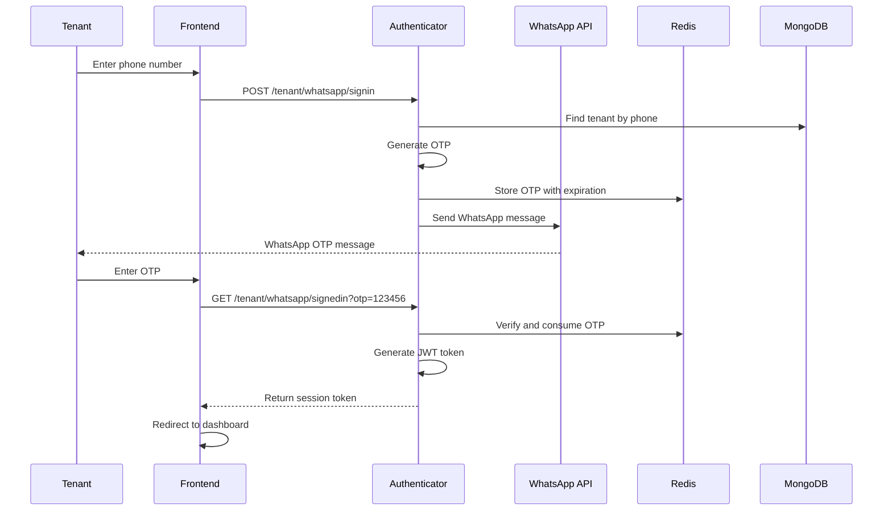

# WhatsApp OTP Integration for Tenant Authentication

This document describes the complete implementation of WhatsApp OTP authentication for the tenant service in MicroRealEstate.

## Overview

The WhatsApp OTP integration allows tenants to authenticate using their WhatsApp phone number instead of email. This is particularly useful for:

- Tenants who prefer WhatsApp communication
- Markets where WhatsApp is the primary communication method (e.g., Latin America)
- Improved user experience with instant message delivery
- Better security through phone-based verification

## Architecture

### Components Modified

1. **Authenticator Service** (`/services/authenticator/`)
   - Added WhatsApp OTP routes for tenants
   - Enhanced JWT token handling for phone-based authentication
   - Integrated WhatsApp Business API

2. **Tenant API Service** (`/services/tenantapi/`)
   - Updated controllers to handle phone-based authentication
   - Enhanced user principal handling

3. **Common Services** (`/services/common/`)
   - Updated middleware to support phone authentication
   - Enhanced type definitions

4. **Tenant Frontend** (`/webapps/tenant/`)
   - Added WhatsApp signin components
   - Updated signin page with method selection
   - Added WhatsApp OTP verification page

## Implementation Details

### 1. Authentication Flow



### 2. Database Schema

The tenant schema already supports phone numbers in the contacts array:

```javascript
contacts: [
  {
    contact: String,
    phone: String,      // Legacy field
    phone1: String,     // Primary phone
    phone2: String,     // Secondary phone
    whatsapp1: Boolean, // WhatsApp enabled for phone1
    whatsapp2: Boolean, // WhatsApp enabled for phone2
    email: String
  }
]
```

### 3. API Endpoints

#### WhatsApp Signin
```http
POST /api/v2/authenticator/tenant/whatsapp/signin
Content-Type: application/json

{
  "phoneNumber": "+573001234567"
}
```

**Response:** `204 No Content` (to prevent phone enumeration)

#### WhatsApp OTP Verification
```http
GET /api/v2/authenticator/tenant/whatsapp/signedin?otp=123456
```

**Response:**
```json
{
  "sessionToken": "jwt_token_here",
  "user": {
    "email": "user@whatsapp.tenant",
    "phone": "+573001234567",
    "role": "tenant",
    "tenantId": "507f1f77bcf86cd799439011"
  }
}
```

### 4. WhatsApp Business API Integration

The integration uses WhatsApp Business API with the following template structure:

```json
{
  "messaging_product": "whatsapp",
  "to": "+573001234567",
  "type": "template",
  "template": {
    "name": "otpcode",
    "language": {
      "code": "es"
    },
    "components": [
      {
        "type": "body",
        "parameters": [
          {
            "type": "text",
            "text": "123456"
          }
        ]
      }
    ]
  }
}
```

### 5. Phone Validation System

The tenant webapp includes a comprehensive phone validation system for WhatsApp OTP authentication:

**Key Features:**
- **International Support**: 25+ countries with proper formatting
- **Country Detection**: Automatic detection from browser locale
- **Dominican Republic Support**: Special handling for DR area codes (809, 829, 849)
- **E.164 Formatting**: Proper formatting for API integration
- **Real-time Validation**: Instant feedback on phone number validity
- **localStorage Integration**: Remembers user's preferred country

**Usage Example:**
```typescript
import { PhoneValidator, CountryData } from '@/utils/phone';

// Validate and format phone number
const result = PhoneValidator.validate('(809) 123-4567', 'DO');
if (result.isValid) {
  // Send E.164 formatted number to API
  await sendWhatsAppOTP(result.e164); // +18091234567
}

// Detect best country for user
const country = CountryData.detectBestCountry();
```

**Testing:**
```bash
# Run phone validation tests
cd webapps/tenant
yarn test src/utils/phone/__tests__/
```

For detailed documentation, see [Phone Validation System](./PHONE_VALIDATION_SYSTEM.md).

### 6. Security Features

- **Rate Limiting**: 5 attempts per 15 minutes per phone number
- **OTP Expiration**: 5-minute expiration for OTP codes
- **Phone Validation**: Comprehensive validation using libphonenumber-js
- **Single Use**: OTP codes are deleted after verification
- **WhatsApp Verification**: Only phones with WhatsApp enabled can receive OTP
- **No Phone Enumeration**: Always returns 204 regardless of phone existence

### 7. Frontend Components

#### Signin Page Enhancement
- Toggle between Email and WhatsApp authentication
- Separate forms for each method
- Responsive design with clear UX

#### WhatsApp OTP Page
- 6-digit OTP input with auto-focus
- Resend OTP functionality
- Clear error handling and user feedback

## Configuration

### Environment Variables

Add these to your `.env` file:

```bash
# WhatsApp Business API Configuration
WHATSAPP_API_URL=https://graph.facebook.com/v18.0
WHATSAPP_ACCESS_TOKEN=your_whatsapp_access_token
WHATSAPP_PHONE_NUMBER_ID=your_phone_number_id

# WhatsApp Login Template Configuration
WHATSAPP_LOGIN_TEMPLATE_NAME=otpcode
WHATSAPP_LOGIN_TEMPLATE_LANGUAGE=es
```

### WhatsApp Business API Setup

1. **Create WhatsApp Business Account**
   - Set up through Meta Business Manager
   - Verify your business

2. **Create WhatsApp Business App**
   - Add WhatsApp Business API to your app
   - Get access token and phone number ID

3. **Create Message Templates**
   - Template name: `otpcode`
   - Category: `AUTHENTICATION`
   - Language: `es` (Spanish) or your preferred language
   - Body: `Tu código de verificación es {{1}}`

4. **Template Approval**
   - Submit template for approval
   - Wait for Meta approval (usually 24-48 hours)

## Testing

### Manual Testing

1. **Setup Test Environment**
   ```bash
   # Run the test script
   node test-whatsapp-otp.js
   ```

2. **Test Phone Numbers**
   - Use WhatsApp test numbers provided by Meta
   - Test with various international formats
   - Verify rate limiting and security features

### Integration Testing

1. **Database Setup**
   - Create test tenant with phone numbers
   - Enable WhatsApp flags in contacts
   - Test with both phone1 and phone2 fields

2. **Frontend Testing**
   - Test signin method toggle
   - Verify OTP input functionality
   - Test error handling and user feedback

## Deployment

### Production Checklist

- [ ] WhatsApp Business API credentials configured
- [ ] Message templates approved by Meta
- [ ] Rate limiting configured
- [ ] Redis configured for OTP storage
- [ ] MongoDB tenant schema includes phone fields
- [ ] Frontend translations complete
- [ ] Security testing completed

### Monitoring

Monitor these metrics in production:

- WhatsApp OTP success rate
- Template delivery rates
- Authentication conversion rates
- Error rates and types
- Rate limiting triggers

## Troubleshooting

### Common Issues

1. **Template Not Found**
   - Verify template name matches `WHATSAPP_LOGIN_TEMPLATE_NAME`
   - Ensure template is approved by Meta

2. **Phone Number Format**
   - Use international format with country code
   - Remove spaces and special characters
   - Validate with regex: `/^\+?[1-9]\d{1,14}$/`

3. **OTP Not Received**
   - Check WhatsApp Business API status
   - Verify phone number has WhatsApp installed
   - Check template approval status

4. **Authentication Failures**
   - Verify JWT secret configuration
   - Check Redis connectivity
   - Validate tenant phone number in database

### Logs and Debugging

Enable debug logging:

```bash
LOGGER_LEVEL=debug
```

Key log messages to monitor:
- `WhatsApp OTP sent successfully`
- `WhatsApp signin successful`
- `Failed to send WhatsApp OTP`
- `WhatsApp OTP has expired`

## Future Enhancements

### Planned Features

1. **Multi-language Templates**
   - Support for multiple languages
   - Dynamic template selection based on tenant locale

2. **Fallback Mechanisms**
   - SMS fallback if WhatsApp fails
   - Email fallback option

3. **Enhanced Security**
   - Device fingerprinting
   - Suspicious activity detection
   - Geographic restrictions

4. **Analytics Dashboard**
   - Authentication method preferences
   - Success/failure rates
   - User experience metrics

### API Extensions

1. **Bulk OTP Sending**
   - For landlord-initiated communications
   - Batch processing capabilities

2. **Template Management**
   - Dynamic template creation
   - A/B testing for templates

## Support

For issues related to WhatsApp OTP integration:

1. Check the troubleshooting section above
2. Review application logs for error messages
3. Verify WhatsApp Business API configuration
4. Test with the provided test script

## Security Considerations

### Data Protection

- Phone numbers are treated as PII
- OTP codes are stored temporarily in Redis
- JWT tokens include minimal user information
- All communications use HTTPS/WSS

### Compliance

- GDPR compliance for EU users
- Data retention policies for OTP codes
- User consent for WhatsApp communications
- Audit logging for authentication events

---

**Version**: 1.0.0  
**Last Updated**: July 2025  
**Author**: Joseph Pérez
